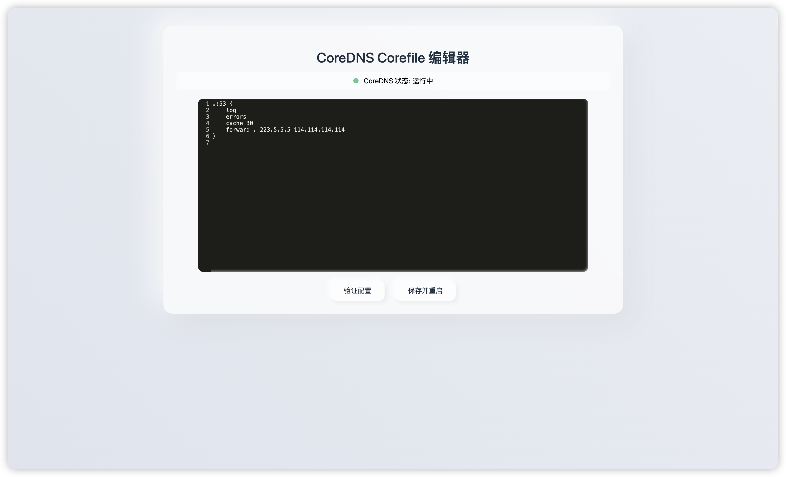

# CoreDNS Corefile Web 编辑器

[](https://opensource.org/licenses/MIT)
[](https://go.dev/)

一个用于管理和编辑 CoreDNS Corefile 配置文件的 Web 界面工具。



## 特点

- 🚀 **单文件部署** - 前端资源嵌入二进制，无需额外文件
- 🎨 **现代化界面** - 使用 CodeMirror 编辑器，支持语法高亮
- ✅ **配置验证** - 保存前自动验证 Corefile 语法
- 📊 **状态监控** - 实时显示 CoreDNS 运行状态
- 🔄 **自动重启** - 保存配置后自动重启 CoreDNS
- 🛡️ **安全回滚** - 重启失败自动恢复原配置
- ⚙️ **零配置** - 使用环境变量，开箱即用

## 权限配置

Web UI 需要权限执行 `systemctl` 命令来管理 CoreDNS 服务。


## 注意事项

- CoreDNS 必须作为 systemd 服务运行（服务名：coredns）
- 确保 CoreDNS 可执行文件在系统 PATH 中用于配置验证
- 建议在生产环境使用前先在测试环境验证

## 功能特性

- ✅ **在线编辑** - 使用 CodeMirror 编辑器，支持语法高亮
- ✅ **配置验证** - 保存前自动验证 Corefile 语法
- ✅ **运行状态监控** - 实时显示 CoreDNS 运行状态（运行中/未运行）
- ✅ **自动重启** - 保存配置后自动重启 CoreDNS
- ✅ **错误回滚** - 如果重启失败，自动恢复原配置

## 安装依赖

```bash
go mod tidy
```

## 配置

程序使用环境变量配置，默认值如下：

| 环境变量 | 默认值 | 说明 |
|---------|--------|------|
| `SERVER_HOST` | `0.0.0.0` | 监听地址 |
| `SERVER_PORT` | `8080` | 监听端口 |
| `COREFILE_PATH` | `/etc/coredns/Corefile` | Corefile 文件路径 |
| `COREDNS_PATH` | `coredns` | CoreDNS 可执行文件路径 |


## 构建

前端模板文件会自动嵌入到二进制文件中（使用 Go embed），无需单独部署。

```bash
sh build.sh
```

## 运行

### 开发模式

```bash
go run main.go
```

### 生产模式

```bash
# 使用默认配置后台运行
nohup ./coredns-webui-linux-amd64 > webui.log 2>&1 &

# 使用自定义配置后台运行
nohup env SERVER_PORT=9090 COREFILE_PATH=/opt/coredns/Corefile ./coredns-webui-linux-amd64 > webui.log 2>&1 &

# 查看日志
tail -f webui.log

# 停止服务
pkill -f coredns-webui-linux-amd64

# 或者找到进程 PID 后停止
ps aux | grep coredns-webui
kill <PID>
```

访问 http://localhost:80

## 使用说明

1. **查看状态** - 页面顶部显示 CoreDNS 当前运行状态
   - 🟢 绿色指示灯：运行中
   - 🔴 红色指示灯：未运行

2. **编辑配置** - 在编辑器中修改 Corefile 内容

3. **验证配置** - 点击"验证配置"按钮，检查配置文件语法是否正确

4. **保存并重启** - 点击"保存并重启"按钮：
   - 自动验证配置文件
   - 保存到磁盘
   - 重启 CoreDNS 服务
   - 如果失败，自动回滚到原配置

## API 接口

- `GET /api/corefile` - 获取当前 Corefile 内容
- `POST /api/corefile` - 更新 Corefile 并重启 CoreDNS
- `POST /api/corefile/validate` - 验证 Corefile 配置
- `GET /api/status` - 获取 CoreDNS 运行状态


## 技术栈

- **后端**: Go + Gin
- **前端**: HTML + JavaScript + CodeMirror
- **配置**: 环境变量

## 许可证

本项目采用 [MIT 许可证](LICENSE)。
